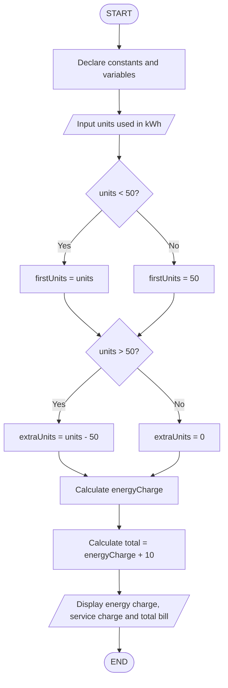

```mermaid
flowchart TD
    A([START]) --> B[Declare constants and variables]
    B --> C[/Input units used in kWh/]
    C --> D{units < 50?}

    D -->|Yes| E[firstUnits = units]
    D -->|No| F[firstUnits = 50]

    E --> G{units > 50?}
    F --> G

    G -->|Yes| H[extraUnits = units - 50]
    G -->|No| I[extraUnits = 0]

    H --> J[Calculate energyCharge]
    I --> J

    J --> K[Calculate total = energyCharge + 10]
    K --> L[/Display energy charge, service charge and total bill/]
    L --> M([END])
```
