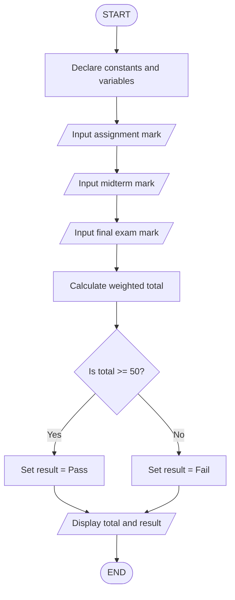

```mermaid
flowchart TD
    A([START]) --> B[Declare constants and variables]
    B --> C[/Input assignment mark/]
    C --> D[/Input midterm mark/]
    D --> E[/Input final exam mark/]
    E --> F[Calculate weighted total]
    F --> G{Is total >= 50?}
    G -->|Yes| H[Set result = Pass]
    G -->|No| I[Set result = Fail]
    H --> J[/Display total and result/]
    I --> J
    J --> K([END])
```
