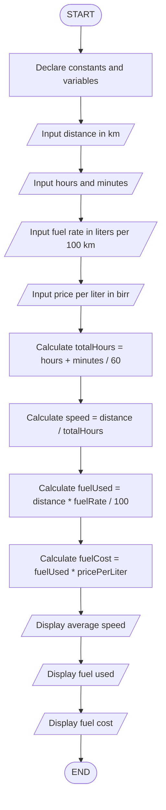

```mermaid
flowchart TD
    A([START]) --> B[Declare constants and variables]

    B --> C[/Input distance in km/]
    C --> D[/Input hours and minutes/]
    D --> E[/Input fuel rate in liters per 100 km/]
    E --> F[/Input price per liter in birr/]

    F --> G[Calculate totalHours = hours + minutes / 60]

    G --> H[Calculate speed = distance / totalHours]

    H --> I[Calculate fuelUsed = distance * fuelRate / 100]

    I --> J[Calculate fuelCost = fuelUsed * pricePerLiter]

    J --> K[/Display average speed/]
    K --> L[/Display fuel used/]
    L --> M[/Display fuel cost/]

    M --> N([END])
```
